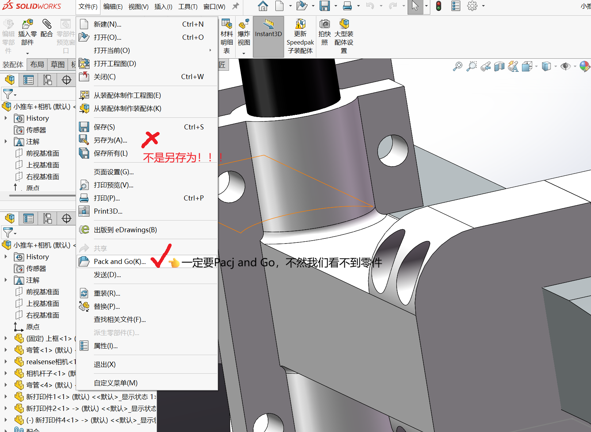
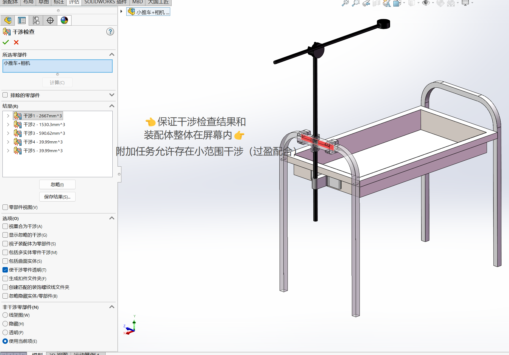

# 机电/嵌入式赛道的参考解决方案

## 简介
- 你需要与其余两人合作，在一周的时间内，用我们提供的板子和模块，参考我们提供的资料，制作一个完整的桌宠。你需要独立完成3D外壳的设计和打印、板子的焊接、以及代码的编写与调试

## 任务
### 机械篇
- 以下有4个TASK，其中TASK1为环境相关，TASK2为基础任务，TASK3为附加任务，TASK4为心得体会。必做任务是TASK1、TASK2与TASK4，建议机械组同学尽快完成前两个任务，方便电控组同学后续进行调试
- 机械组的同学们，学长学姐已经默认你们这一学期已经学到了SolidWorks等3D建模软件的绘图功能以及BambuStudio的基础参数设置，这两个软件功能还不太熟练的同学请先从b站上自学相应的内容，方便后续任务的完成
- TASK1：**环境搭建**\
  良好的开端是成功的一半，请确保你的电脑上已经有SolidWorks（2024版，一定要是这个版本，不然学长学姐们打不开你的文件）和BambuStudio两款软件，还没有下载的同学可以参考以下资料:  
  Solidworks（2024版）一键下载：https://www.bilibili.com/video/BV14rDwYnEpe/?spm_id_from=333.337.search-card.all.click&vd_source=fcc63609845574c1206cec5c666affba  
  BambuStudio请自行到拓竹官网上进行下载
- TASK2：**基础任务**  
  - TASK2.0：**机械小狗的建模与装配**
    - TASK 2.0.0: **小狗本体的建模**\
      你需要通过SolidWorks进行小狗本体的建模、舵机建模、LCD屏建模等  
      (1)：小狗本体的建模应有预留的可以给舵机、LCD平以及电路板固定的孔位，明显的棱边需要进行倒角或圆角处理  
      (2)：舵机、LCD屏的建模应尽可能准确，方便后续装配。你也可以向商家索要模型  
      (3)：小狗本体的建模应使用尽可能少的特征树，这样既易读懂又方便后续修改
    - TASK 2.0.1：**机械小狗的装配**\
      单个零件并没有什么作用，他们装配起来才是一个完整的机构  
      你需要把所有的零件装配成一个装配体，并进行干涉检查  
      最后，将“小狗本体特征树截图”、“装配体打包”以及“干涉检查截图”与软件组一起上传在git地址里  
      
      
      
  - TASK2.1 **小狗本体的3D打印**\
    先前没有使用过BambuStudio的小伙伴请从b站上学习完相应3D打印知识后再进行小狗本体等3D打印
- TASK3：**附加任务**\
  我们所做的一切的一切都是为了做出一个完整的产品，而完整的产品要求好的封装  
  你需要设计出一个外壳，尽可能地包裹住内部的电路  
  (1)：这只是附加任务，你设计的小狗外壳不应干扰小狗的正常功能  
  (2)：你所设计的外壳要稳定，不能存在走几步就松动的情况  
  (3)：小狗外壳要方便拆解，请不要直接用胶水粘上，这样不方便后续调试
- TASK4：**心得体会**\
  闻一多先生有言：“莫问收获，但问耕耘”。无论结果如何，我们总会在前进的过程中收获很多  
  请写一篇关于你在冬令营收获了什么的文章，文体不限，字数不少于300字，并连同先前的文件一起传到git地址里  
### 电路篇

### 软件篇
- 以下有3个TASK,其中TASK1为环境相关，TASK2为基础任务，TASK3为附加任务。建议基础任务由两人分工完成。大一同学至少完成基础任务，大二同学在完成基础任务的基础上再至少完成一个附加任务
- 嵌软的同学，学长学姐已经默认你们这一学期已经学习了C/C++的编程，对于github的使用，学长不多介绍了。你们需要创建自己的github仓库，上传你们的作品，并写明一个README文件给我们介绍你们的作品。git仓库地址需要你们私发给我们
- examples目录下存放一些学长跑通了的历程，给各位参考
- datasheets目录下存放一些可能用到的资料，供各位查阅
- TASK1：**环境搭建**
  - TASK1.0:**搭建环境**
    - TASK1.0.0：**搭建esp-idf的环境**\
      千里之行，始于足下！开发一块板子你首先需要一个开发环境。推荐下载vscode,在其中下载C\C++编译器、esp-idf等拓展，详见下面视频：...
    - TASK1.1.0：**点亮一个LED灯泡💡**\
      看来你已经配完了环境，太棒了！但是环境配好了不一定代表esp代码可以很顺利地编译、下载、与调试呢~~实践是检验真理的唯一标准，接下来我们试试点亮板载的LED，看看我们的环境是否完全搭建好了吧！参考下面的视频：...
- TASK2：**基础任务**  
  - TASK2.0：**Movement**    
    - TASK2.0.0：**看看学长为你们准备的资料**\
      网址：...
    - TASK2.0.1：**让舵机动起来**\
    测试四个舵机，看看它们能不能转动到你想要的位置
    - TASK2.0.2：**试试四个舵机怎么协调运动，可以让桌宠动起来？**
    - TASK2.0.3：**实现前后左右自由运动**\
      录一段视频，让我们看见你的宠物动起来了～
    - TASK2.0.4：**你可以DIY一些喜欢的动作**\
        自定义一些可爱的动作，萌化学长学姐，你更可以让我们关注到你哦～
  - TASK2.1：**Audio**
    - TASK2.1.0：**看看学长为你们准备的资料**\
      网址：...
    - TASK2.1.1：**实现mp3语音播放**\
      你需要把音频下载到flash中，然后用喇叭播放出来。你可以事先录制几段可爱的音频，作为桌宠的声音。
    - TASK2.1.2：**实现离线词的使用**\
      好了，你现在已经学会了怎么输出语音了，真棒👍！但是要实现人与桌宠的对话，还要让桌宠听懂你的话。这就需要esp32的音频输入与语音识别功能了——esp公司帮你训练好了微型的语音识别模型，你需要选择模型的类型，并将模型下载到esp32s3的flash中。在代码中写入你要esp32识别的语音，esp32就会进行相应的检测啦～
    - TASK2.1.3：**跟你的桌宠实现对话**\
      好了，你已经完美地实现语音的输入与输出了，让学长学姐看到你们的努力——录制一段视频，内容是桌宠听懂了你的唤醒词，并且回复你一句话。
    - TASK2.1.4：**用离线词实现运动控制吧**\
      想必你/你得力的队员已经把运动控制搞定了，现在给桌宠说一句”前进“，让它向前冲吧！这里也录一段视频，展现上面的效果！
  - TASK2.2：**Display**\
    想必有同学已经看过江科大的stm32教程，里面有一个很好的调试工具与显示装置——OLED屏幕(没看过也不要紧)。但是那个OLED是个黑白的，像素不高，教程里制作好看的图形也很麻烦。下面你们会接触到LCD屏幕，上面每个像素点使用RGB格式可以实现多种颜色的展示，而且我们即将使用的工具——LVGL也是嵌入式中制作好看图形的有力的库。
    - TASK2.2.0：**看看学长为你们准备的资料**\
      网址：...
    - TASK2.2.1：**点亮一个屏幕**\
      下面我们先跟着教程点亮一个屏幕吧！
    - TASK2.2.2：**移植并测试LVGL**
      好了，现在跟着教程移植并测试LVGL——显示一张图片看看。
    - TASK2.2.4：**定义一些可爱的表情吧** 
      自由探索LVGL库，制作一些可爱的表情吧。
- TASK3：**附加任务**
  - TASK3.0：**IOT**\
    Esp32内置了WiFi和蓝牙模组，对于实现物联网非常方便，这也是它能风靡全球的原因之一，接下来我们用esp32开发物联网功能吧。
    - Task3.0.0：**看看学长为你们准备的资料**\
      网址：...
    - Task3.0.1：**让桌宠连上你的WiFi**\
      连上网络是进行物联网的基础，现在试着使用esp32的wifi功能，让它连上你的wifi
    - Task3.0.2：**使用MQTT协议测试连接**
    - Task3.0.3：**部署服务器，实现物联网功能**\
      使用阿里云/其他云/EMQX，部署服务器实现MQTT通讯，尝试上报一些传感器数据给云端，或发送指令让桌宠做些动作（比如点个灯）
  - TASK3.1：**Sensors**
